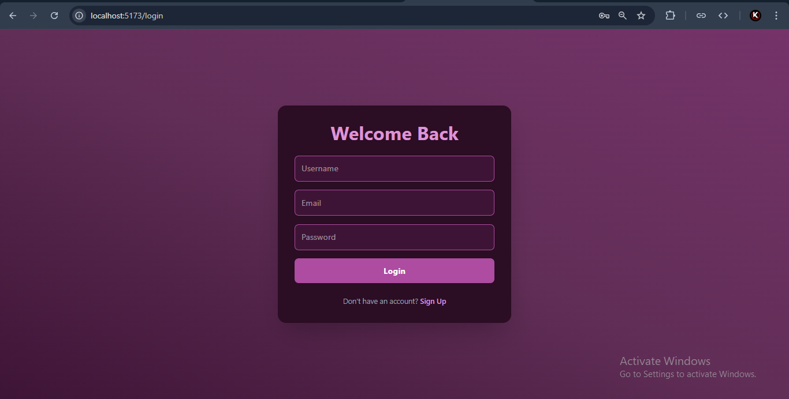

# Registration-Email--Nodemailer

> A full-stack email authentication app built with Node.js, Express, and Nodemailer. Users can register, log in, and log out with real-time email notifications. Emails are sent instantly upon signup and login, using SMTP via Nodemailer. Frontend is custom-designed and connected with Axios for smooth API handling.

---
### Day 1 - Sunday - 27-04-2025
    - Setup Folders
    - Create UI for Login and Signup from Chatgpt
    - This time, create a new color palette for experiments 😁

### Day 2 - Monday - 28-04-2025
    - Setup Backend Folders
    - Create a API for Register User, Login User
    - Tested on Postman

### Day 3 - Wednesday - 30-04-2025
    - Implement an API for Register User, Login User, Logout User using Axios
    - Tested on Postman

### Day 4 - Friday - 02-05-2025
    - Setup Nodemailer and Create Less Secure Password
    - Testing The App
---
## 📸 Screenshots

### 🏠 Home Page

### 🔐 Signup Page

### 🔑 Login Page

### 📩 Signup Email Received

### 📥 Login Email Received

